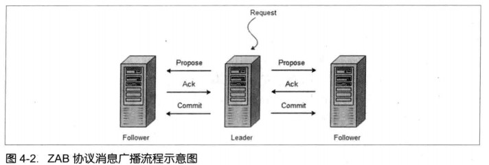
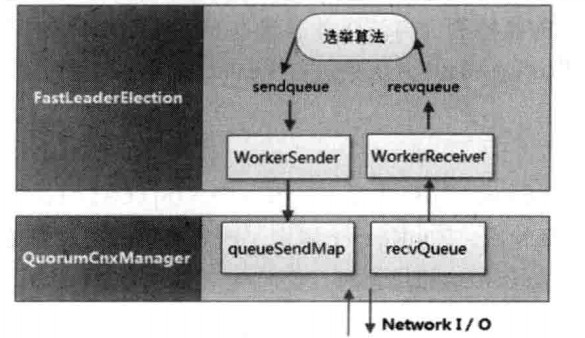
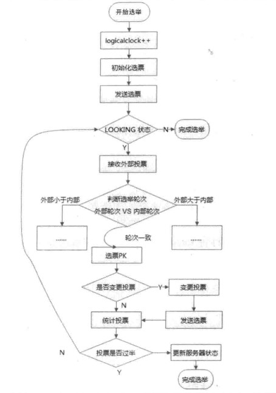

# 目录


# Paxos 算法

**问题描述**

假设有一组可以提出提案的进程集合，那么对于一个一致性算法来说需要保证以下几点：

- 在这些被提出的提案中，只有一个会被选定；
- 如果没有提案被提出，那么就不会有被选定的提案；
- 当一个提案被选定后，进程应该可以获取被选定的提案信息；

对于一致性来说，安全性需求如下：

- 只有被提出的提案才能被选定；
- 只能有一个值被选定；
- 如果某个进程认为某个提案被选定了，那么这个提案必须是真的被选定的那个。

在该一致性算法中，有三种参与角色，我们用 Proposer、Acceptor 和 Learner 来表示。

**提案的选定**

在存在多个 Acceptor 的情况下，如何进行提案的选取？

Proposer 向一个 Acceptor 集合发送提案，同样，集合中的每个 Acceptor 都可能会批次该提案，当有足够多的 Acceptor 批准这个提案的时候，我们就可以认为该提案被选定了。

（足够多可以理解为至少大于总数的一半。）

**算法陈述**

> 我们使用一个全局的编号来唯一标识每一个被 Acceptor 批准的提案，当一个具有某 Value 值的提案被半数以上的 Acceptor 批准后，我们就认为该 Value 被选定了，此时我们也认为该提案被选定了。
>
> 这里需要注意，提案变成了一个由编号和 Value 组成的组合体，我们以 [编号, Value] 来表示一个提案。

结合 Proposer 和 Acceptor 对提案的处理逻辑，就可以得到如下类似于两阶段提交的算法执行过程。

- 阶段一

  1. Proposer 选择一个提案编号 Mn，然后向 Acceptor 的某个超过半数的子集成员发送编号为 Mn 的 Prepare 请求；

  2. 如果一个 Acceptor 收到一个编号为 Mn 的 Prepare 请求，且编号 Mn 大于该 Acceptor 已经响应的所有 Prepare 请求的编号，那么它就会将它已经批准过的最大编号的提案作为响应反馈给 Proposer，同时该 Acceptor 承诺不会再批准任何编号小于 Mn 的提案；

     举个例子来说，假定一个 Acceptor 已经响应过的所有 Prepare 请求对应的提案编号分别为1、2、...、5 和 7，那么该 Acceptor 在接收到一个编号为 8 的 Prepare 请求后，就会将编号为 7 的提案作为响应反馈给 Proposer，同时该 Acceptor 承诺不会再批准任何编号小于 8 的提案。

- 阶段二

  1. 如果 Proposer 收到来自半数以上的 Acceptor 对于其发出的编号为 Mn 的Prepare 请求的响应，那么它就会发送一个针对 [Mn, Vn] 提案的 Acceptor 请求给 Acceptor 。注意，Vn 的值就是收到的响应中编号最大的提案的值，如果响应中不包含任何提案，那么它就是任意值。
  2. 如果 Acceptor 收到这个针对 [Mn, Vn] 提案的 Acceptor 请求，只要该 Acceptor 尚未对编号大于 Mn 的 Prepare 请求做出响应，它就可以通过这个提案。

在实际运行过程中，每个 Proposer 都有可能会产生多个提案，也可以在任意时刻丢弃一个提案。如果一个 Acceptor 因为已经收到更大编号的 Prepare 请求而忽略某个编号更小的 Prepare 或者 Accept 请求，那么它也应当通知其对应的 Proposer，以便该 Proposer 也能够将该提案进行丢弃。

**提案的获取**

在上文中，我们已经介绍了如何来选定一个提案，下面我们再来看看如何让 Leader 获取提案，大体可以有以下几种方案。

- 方案一

  一旦 Acceptor 批准了一个提案，就将该提案发送给所有的 Learner。

  这种做法可以让 Learner 尽快获取被选定的提案，但却需要让每个 Acceptor 与所有的 Learner 逐个进行通信，通信次数至少为二者个数的乘积。

- 方案二

  我们可以让所有的 Acceptor 将它们对提案的批准情况，统一发送给一个特定的 Learner（主 Learner），当主 Learner 被通知一个提案已经被选定时，它会负责通知其他的 Learner。

  这样通信次数就大大减少了，通常只是 Acceptor 和 Learner 的个数总和。但这个方案引入了一个新的不稳定因素：主 Learner 随时可能出现故障。

- 方案三

  Acceptor 可以将批准的提案发送给一个特定的 Learner 集合，该集合中的每个 Learner 都可以在一个提案被选定后通知所有其他的 Learner。

  这个 Learner 集合中的 Learner 个数越多，可靠性就越好，但同时网络通信的复杂度也就越高。

**通过选取主 Proposer 保证算法的活性**

下面我们再来看看 Paxos 算法在实际运行过程中的一些细节。

假设存在这样一种极端情况，有两个 Proposer 依次提出了一系列编号递增的提案，但是最终都无法被选定。

（具体例子可以在脑海中想一下。相当于拍卖会上两个买家无止境的慢慢抬高价格。）

为了保证 Paxos 算法流程的可持续性，以避免陷入"死循环"，就必须选择一个主 Proposer，并规定只有主 Proposer 才能提出方案。

# ZAB 协议

**ZAB协议介绍**

ZooKeeper 并没有完全采用 Paxos 算法，而是使用了一种称为 ZooKeeper Atomic Broadcast（ZooKeeper 原子消息广播协议）的协议作为其数据一致性的核心算法。基于该协议，ZooKeeper 实现了一种主备模式系统架构来保持集群中各副本之间数据的一致性。

ZAB 协议包括两种基本的模式，分别是崩溃恢复和消息广播。

- 崩溃恢复

当整个服务框架在启动过程中，或是当 Leader 服务器出现故障时，ZAB 协议就会进行恢复模式并选举产生新的 Leader 服务器。

ZAB 协议需要一个高效且可靠的 Leader 选举算法，从而确保能够快速地选举出新的 Leader。同时还需要让集群中所有其他机器快速感知到选举产生的新的 Leader 服务器。

- 消息广播

当集群中已经有过半的 Follower 服务器完成了和 Leader 服务器的状态同步，那么整个服务框架就可以进入消息广播模式了。



大消息广播过程中，Leader 服务器会为每一个 Follower 服务器都各自分配一个单独的队列，然后将需要广播的事务 Proposal 依次放入到这些队列中去，并且根据 FIFO 策略进行消息发送。

每一个 Follower 服务器在接收到这个事务 Proposal 之后，都会首先将其以事务日志的形式写入到本地磁盘中去，并且在成功写入后反馈给 Leader 服务器一个 Ack 响应。当 Leader 服务器接收到超过半数 Follower 的 Ack 响应后，就会广播一个 Commit 消息给所有的 Follower 服务器以通知其进行事务提交，而每一个 Follower 服务器在接收到 Commit 消息后，也会完成对事务的提交。

**深入 ZAB 协议**

整个 ZAB 协议主要包括消息广播和崩溃恢复两个过程，进一步可以细分为三个阶段，分别是发现（Discovery）、同步（Synchronization）和广播（Broadcast）阶段。

- 阶段一：发现

  这阶段主要就是 Leader 选举过程。

- 阶段二：同步

  这阶段主要是为了保证 Leader 在新的周期中提出事务 Proposal 之前，所有的进程都已经完成了对之前所有事务 Proposal 的提交。

- 阶段三：广播

  主进程开始提出它自己的提案。

**ZAB 与 Paxos 算法的联系与区别**

ZAB 协议并不是 Paxos 算法的一个典型实现，两者有如下的联系。

- 两者都存在一个类似于 Leader 进程的角色，由其负责协调多个 Follower 进程的运行；
- Leader 进程都会等待超过半数的 Follower 做出正确的反馈后，才会将一个提案进行提交；
- 在 ZAB 协议中，每个 Proposal 中都包含了一个 epoch 值 ，用来代表当前的 Leader 周期，在Paxos 算法中，同样存在这样一个标识，只是名字变成了 Ballot。

在 Paxos 算法中，一个新选举产生的主进程会进行两个阶段的工作。第一阶段称为读阶段，在这个阶段中，这个新的主进程会和所有其他进程进行通信来收集上一个主进程提出的提案，并将它们提交。第二阶段被称为写阶段，在这个阶段中，当前主进程开始提出它自己的提案。

ZAB 协议在 Paxos 算法的基础上添加了一个同步阶段。在同步阶段之前，ZAB 协议存在一个和 Paxos 算法中读阶段非常类似的过程，称为发现阶段。在同步阶段中，新的 Leader 会确保存在过半的 Follower 已经提交了之前的 Leader 周期中的所有事务 Proposal。这一同步阶段能够有效地保证 Leader 在新的周期中提出事务 Proposal 之前，所有的进程都已经完成了对之前所有事务 Proposal 的提交。一旦完成同步阶段后，那么 ZAB 就会执行和 Paxos 算法类似的写阶段。

理解了 Paxos 算法和 ZAB 协议。下面我们将从 Leader 选举概述、算法分析和实现细节三个方面来看看 ZooKeeper 是如何进行 Leader 选举的。

# Leader 选举概述

Leader 选举是 ZooKeeper 中最重要的技术之一，也是保证分布式数据一致性的关键所在。

**服务器启动时期的 Leader 选举**

Leader 选举隐式条件是 ZooKeeper 的集群规模至少是 2 台机器。当 2 台机器都启动后，每台机器都试图找到一个 Leader，于是便进入了 Leader 选举流程。

1. 每个 Server 会发出一个投票。

   初始情况下，对于 Server1 和 Server2 来说，都会将自己作为 Leader 服务器来进行投票，每次投票包含的最基本的元素包括：所推举的服务器的 myid 和 ZXID，我们以（myid，ZXID）的形式来表示。

   因此 Server1 的投票为（1，0），Server2 的投票为（2，0），然后各自将这个投票发给集群中其他所有机器。

2. 接收来自各个服务器的投票。

   集群中的每台服务器在接收到投票后，首先会判断该投票的有效性，包括检查是否是本轮投票、是否来自 LOOKING 状态的服务器。

   （怎么确定是本轮投票的？）

3. 处理投票。

   服务器将别人的投票和自己的投票进行 PK，规则如下：

   a. 优先检查 ZXID。ZXID 比较大的服务器优先作为 Leader；<br>b. 如果 ZXID 相同的话，那么就比较 myid。myid 比较大的服务器作为 Leader 服务器。

   因此 Server1 会更新自己的投票为（2，0），然后重新将投票发出去；对于 Server2 来说，不需要更新投票信息，只需要再一次发送相同的投票信息即可。

4. 统计投票。

   每次投票后，服务器都会统计所有投票，判断是否已经有过半的机器接收到相同的投票信息。假如有 3 台机器构成集群，大于等于 2 台即达到过半要求。

   那么，当 Server1 和 Server2 都收到相同的投票信息（2，0）的时候，即认为已经选出了 Leader。

5. 改变服务器状态。

   一旦确定了 Leader，每个服务器就会更新自己的状态：如果是 Follower，那么就变更为 FOLLOWING，如果是 Leader，那么就变更为 LEADING。

**服务器运行期间的 Leader 选举**

一旦 Leader 所在的机器挂了，那么整个集群将暂时无法对外服务，而是进入新一轮的 Leader 选举。

假设正在运行的机器是 Server1、Server2、Server3，当前的 Leader 是 Server2。

1. 变更状态。

   当 Leader 挂了之后，剩下的非 Observer 服务器都会将自己的服务器状态变更为 LOOKING，然后开始进入 Leader 选举流程。

2. 后面步骤同启动时投票。

# Leader 选举的算法分析

在 ZooKeeper 中，提供了三种 Leader 选举的算法，分别是 LeaderElection、UDP 版本的 FastLeaderElection 和 TCP 版本的 FastLeaderElection，可以在配置文件 zoo.cfg 中使用 electionAlg 属性来指定。

```shell
## 0代表LeaderElection
## 1代表UDP版本的FastLeaderElection,且是非授权模式
## 2代表UDP版本的FastLeaderElection,且是授权模式
## 3代表TCP版本的FastLeaderElection
electionAlg=0
```

**TCP 版本的 FastLeaderElection 选举算法**

ZooKeeper 3.4.0版本只保留了 TCP 版本的 FastLeaderElection 选举算法。

> 术语解释
>
> SID：服务器ID。和 myid 的值一致。<br>ZXID：事务ID。<br>Vote：投票。<br>Quorum：过半机器数。如果总机器数是n，那么 quorum=(n/2 + 1)。

假设集群中有 5 台机器，SID 分别为1、2、3、4和5，ZXID 分别为9、9、9、8和8，此时 SID 为 2 的机器是 Leader。某一时刻，1 和 2 所在机器出现故障，因此集群开始进行 Leader 选举。

1. 开始第一次投票。

   每台机器都将自己作为被推举的对象，于是投票情况分别为：

   （3，9）、（4，8）、（5，8）。

2. 变更投票。

   对于 Server3 来说，它接收到了（4，8）和（5，8）两个投票。对比后，由于自己的 ZXID 最大，因此投票信息不做任何变更，然后将投票发送给另外两台机器。

   对于 Server4 来说，它接收到了（3，9）和（5，8）两个投票。对比后，投票信息变更为（3，9），然后将投票发送给另外两台机器。

   对于 Server5 来说，它接收到了（3，9）和（4，8）两个投票。对比后，投票信息变更为（3，9），然后将投票发送给另外两台机器。

3. 确定 Leader。

   经过投票后，集群中的每台机器都会再次收到其他机器的投票，然后开始统计投票。如果一台机器收到了超过半数的相同的投票，那么这个投票对应的 SID 机器即为 Leader。

   因为 ZooKeeper 集群总机器数为 5 台，那么 quorum = (5/2 + 1) = 3。

   也就是说，只要收到 3 个 或 3 个以上（含当前服务器自身在内）一致的投票即可。在这里，Server3、Server4 和 Server5 都投票（3，9），因此确定了 Server3 为 Leader。

简单地说，通常哪台服务器上的数据越新，那么它的 ZXID 也就越大，越有可能成为 Leader。

# Leader 选举的实现细节

我们来看看 ZooKeeper 中对 FastLeaderElection 的实现。

**服务器状态：ServerState**

服务器有 4 个状态，QuorumPeer.ServerState 类描述如下：

```java
public enum ServerState {
    /** 寻找Leader状态 */
    LOOKING,
    /** 跟随者状态 */
    FOLLOWING,
    /** 领导者状态 */
    LEADING,
    /** 观察者状态 */
    OBSERVING
}
```

**投票数据结构：Vote**

在上面选举过程中我们提到，每个投票中应该包含两个最基本的信息：所推举服务器的 SID 和 ZXID。现在我们来看一下 ZooKeeper 对 Vote 的定义：

```java
public class Vote {
    /** 被推举的Leader的SID值 */
    private final long id;
    /** 被推举的Leader的事务ID */
    private final long zxid;
    /**
     * 逻辑时钟，用来判断多个投票是否在同一轮选举周期中。 
     * 该值在服务端是一个自增序列，每次进入新一轮的投票后，都会对该值进行加1操作
     */
    private final long electionEpoch;
    /** 被推举的Leader的epoch */
    private final long peerEpoch;
    /** 当前服务器状态 */
    private final ServerState state;
}

```

**网络I/O管理器：QuorumCnxManager**

每台服务器启动的时候，都会启动一个 QuorumCnxManager，负责各台服务器之间的底层 Leader 选举过程中的网络通信。

```java
public class QuorumCnxManager {
    /**
     * 消息接收队列，用于存放那些从其他服务器接收到的消息。
     */
    public final BlockingQueue<Message> recvQueue;
    /**
     * 消息发送队列，用于保存那些待发送的消息。
     * 按照SID进行分组，分别为集群中的每台机器分配了一个单独队列，从而保证各台机器之间的消息发送互不影响。
     */
    final ConcurrentHashMap<Long, BlockingQueue<ByteBuffer>> queueSendMap;
    /**
     * 发送器集合。每个SendWorker消息发送器，都对应一台远程ZooKeeper服务器，负责消息的发送。
     * 同样也按照SID进行了分组。
     */
    final ConcurrentHashMap<Long, SendWorker> senderWorkerMap;
    /**
     * 最近发送过的消息。在这个集合中，为每个SID保留最近发送过的一个消息。
     */
    final ConcurrentHashMap<Long, ByteBuffer> lastMessageSent;
}
```

为了能够进行互相投票，ZooKeeper 集群中的所有机器都需要两两建立起网络连接。QuorumCnxManager 在启动的时候，会创建一个 ServerSocket 来监听 Leader 选举的通信端口（默认是 3888）。

开户端口监听后，ZooKeeper 就能够不断地接收到来自其他服务器的“创建连接”请求，在接收到其他服务器的 TCP 连接请求时，会交由 receiveConnection 函数来处理。

```java
public void receiveConnection(final Socket sock) {
    DataInputStream din = null;
    try {
        ...
        handleConnection(sock, din);
    } catch (IOException e) {
        closeSocket(sock);
    }
}
```

为了避免两台机器之间重复地创建 TCP 连接，ZooKeeper 设计了一种建立 TCP 连接的规则：只允许 SID 大的服务器主动和其他服务器建立连接，否则断开连接。

服务器通过对比自己和远程服务器的 SID 值，来判断是否接受连接请求。如果发现自己的 SID 值更大，那么会断开当前连接，然后自己主动去和远程服务器建立连接。

一旦建立起连接，就会根据远程服务器的 SID 来创建相应的消息发送器 SendWorker 和消息接收器 RecvWorker，并启动他们。

```java
private void handleConnection(Socket sock, DataInputStream din) throws IOException {
    if (sid < self.getId()) { // 发现自己的SID值更大
        ...
        // 断开当前连接
        closeSocket(sock);
        // 自己主动去和远程服务器建立连接
        if (electionAddr != null) {
            connectOne(sid, electionAddr);
        } else {
            connectOne(sid);
        }

    } else if (sid == self.getId()) {
        // 自己连上了自己，打印警告日志
    } else { // Otherwise start worker threads to receive data.
        // 消息发送器
        SendWorker sw = new SendWorker(sock, sid);
        // 消息接收器
        RecvWorker rw = new RecvWorker(sock, din, sid, sw);
        sw.setRecv(rw);
        SendWorker vsw = senderWorkerMap.get(sid);
        if (vsw != null) {
            vsw.finish();
        }
        // 添加到发送器集合
        senderWorkerMap.put(sid, sw);
        // 添加到消息发送队列
        queueSendMap.putIfAbsent(sid, new CircularBlockingQueue<>(SEND_CAPACITY));
        sw.start();
        rw.start();
    }
}
```

接着我们来看消息接收与发送是怎么实现的。

消息的接收是由 RecvWorker 来负责的，每个 RecvWorker 只需要不断地从这个 TCP 连接中读取消息，并将其保存到 recvQueue 队列中。

消息的发送是由 SendWorker 来负责的，每个 SendWorker 只需要不断地从对应的消息发送队列 中获取出一个消息来发送即可，同时将这个消息放入 lastMessageSent 中来作为最近发送过的消息。

**选举算法：FastLeaderElection**

最后，我们来看 FastLeaderElection 是如何实现选举算法的。

> 术语解释
>
> 外部投票：特指其他服务器发来的投票。<br>内部投票：服务器自身当前的投票。<br>选举轮次：ZooKeeper 服务器 Leader 选举的轮次，即 logicalclock。<br>PK：指对内部投票和外部投票进行一个对比来确定是否需要变更内部投票。

```java
public class FastLeaderElection implements Election {
    /**
     * 选票发送队列，用于保存待发送的选票。
     */
    LinkedBlockingQueue<ToSend> sendqueue;
    /**
     * 选票接收队列，用于保存接收到的外部投票。
     */
    LinkedBlockingQueue<Notification> recvqueue;
    
    protected class Messenger {
        /**
         * 选票接收器。
         * 不断从QuorumCnxManager中获取出其他服务器发来的选举消息，并将其转换成一个选票，然后保存到recvqueue队列中去。
         */
        class WorkerReceiver extends ZooKeeperThread {
            // 如果发现该外部投票的选举轮次小于当前服务器，那么就直接忽略这个外部投票，同时立即发出自己的内部投票。
            // 如果当前服务器并不是LOOKING状态，即已经选举出了Leader，那么也将忽略这个外部投票，同时将Leader信息以投票的形式发送出去。
            // 如果接收到的消息来自Observer服务器，那么就忽略该消息，并将自己当前的投票发送出去。
        }
        /**
         * 选票发送器。
         * 不断地从sendqueue队列中获取待发送的选票，并将其传递到底层QuorumCnxManager中去。
         */
        class WorkerSender extends ZooKeeperThread {
            
        }
    }
}
```

下图展示了 Leader 选举算法实现的流程示意图。



流程图如下：



当 ZooKeeper 服务器检测到当前服务器状态变成 LOOKING 时，就会触发 Leader 选举，即调用 lookForLeader方法来进行 Leader 选举。

1. 自增选举轮次。

2. 初始化选票。

   初始化 Vote 类。

3. 发送初始化选票。

   将初始化好的选票放入 sendqueue 队列中，由发送器 WorkerSender 负责发送出去。

4. 接收外部选票。

   不断从 recvqueue 队列中获取外部投票。

5. 判断选举轮次。

   如果外部投票选举轮次大于内部投票，那么立即更新自己的选举轮次（logicalclock），并且清空所有已经收到的投票，然后使用初始化的投票来进行PK以确定是否变更内部投票，最终再将内部投票发送出去；

   如果外部投票选举轮次小于内部投票，那么直接忽略该外部投票，不做任何处理，并返回步骤4；

   如果外部投票选举轮次等于内部投票，那么就开始进行选票PK。

6. 选票PK。

   核心逻辑在 FastLeaderElection # totalOrderPredicate 方法里实现。

   如果外部投票中被推举的 Leader 服务器的选举轮次大于内部投票，那么就需要进行投票变更；

   如果选举轮次一致的话，那么就对比两者的 ZXID。如果外部投票的 ZXID 大于内部投票，那么就需要进行投票变更；

   如果两者的 ZXID 一致，那么就对比两者的 SID。如果外部投票的 SID 大于内部投票，那么就需要进行投票变更。

7. 变更投票。

8. 选票归档。

   recvset 用于记录当前服务器本轮次的 Leader 选举中收到的所有外部投票--按照服务器对应的 SID 来区分，例如 {(1, vote1), (2, vote2), ...}。

9. 统计投票。

   统计集群中是否已经有过半的服务器认可了当前的内部投票。如果认可了，则终止投票。否则返回步骤4。

10. 更新服务器状态。

    服务器首先判断投票结果是不是自己，如果是自己的话，就会将自己的服务器状态更新为 LEADING。如果不是自己，那么就会根据具体情况来确定自己是 FOLLOWING 或是 OBSERVING。

以上 10 个步骤，就是 FastLeaderElection 选举算法的核心步骤，其中步骤 4-9 会经过几轮循环，直到 Leader 选举产生。

另外还有一个细节需要注意，如果统计投票发现已经有过半的服务器认可了当前的选票，这个时候 ZooKeeper 并不会立即更新服务器状态，而是会等待一段时间（默认是 200ms）来确定是否有新的更优的投票。

