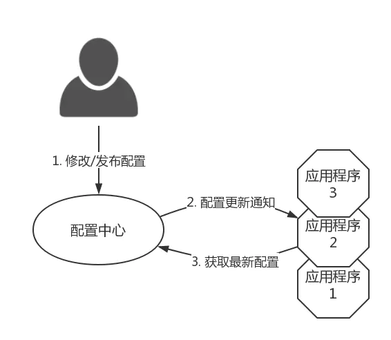
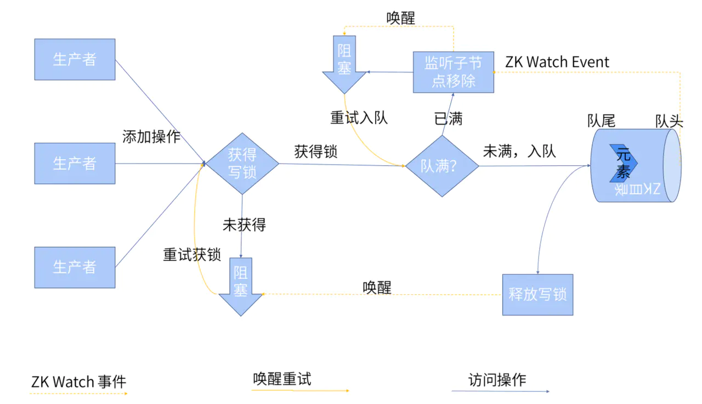
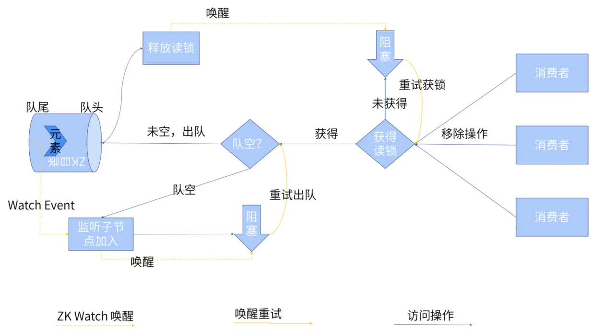
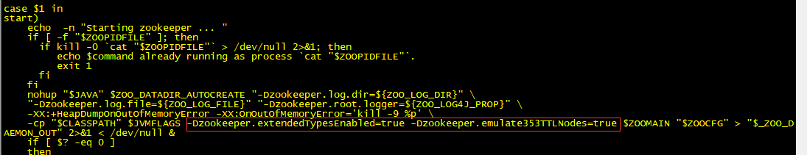

 


 

# **目录**


# 01 | 什么是 ZooKeeper？

**ZooKeeper 由来**

下面这段内容摘自《从 Paxos 到 Zookeeper》第四章第一节的某段内容：

Zookeeper最早起源于雅虎研究院的一个研究小组。在当时，研究人员发现，在雅虎内部很多大型系统基本都需要依赖一个类似的系统来进行分布式协调，但是这些系统往往都存在分布式单点问题。所以，雅虎的开发人员就试图开发一个通用的无单点问题的分布式协调框架，以便让开发人员将精力集中在处理业务逻辑上。

关于“ZooKeeper”这个项目的名字，其实也有一段趣闻。在立项初期，考虑到之前内部很多项目都是使用动物的名字来命名的（例如著名的Pig项目)，雅虎的工程师希望给这个项目也取一个动物的名字。时任研究院的首席科学家RaghuRamakrishnan开玩笑地说：“再这样下去，我们这儿就变成动物园了！”此话一出，大家纷纷表示就叫动物园管理员吧一一因为各个以动物命名的分布式组件放在一起，雅虎的整个分布式系统看上去就像一个大型的动物园了，而Zookeeper正好要用来进行分布式环境的协调一一于是，Zookeeper的名字也就由此诞生了。

**ZooKeeper 概览**

ZooKeeper 是一个开源的分布式协调服务，ZooKeeper框架最初是在“Yahoo!"上构建的，用于以简单而稳健的方式访问他们的应用程序。 后来，Apache ZooKeeper 成为 Hadoop，HBase 和其他分布式框架使用的有组织服务的标准。 例如，Apache HBase 使用 ZooKeeper 跟踪分布式数据的状态。

ZooKeeper 的设计目标是将那些复杂且容易出错的分布式一致性服务封装起来，构成一个高效可靠的原语集，并以一系列简单易用的接口提供给用户使用。

> 原语： 操作系统或计算机网络用语范畴。是由若干条指令组成的，用于完成一定功能的一个过程。具有不可分割性，即原语的执行必须是连续的，在执行过程中不允许被中断。

ZooKeeper 是一个典型的分布式数据一致性解决方案，分布式应用程序可以基于 ZooKeeper 实现诸如数据发布/订阅、负载均衡、命名服务、分布式协调/通知、集群管理、Master 选举、分布式锁和分布式队列等功能。

ZooKeeper 一个最常用的使用场景就是用于担任服务生产者和服务消费者的注册中心（提供发布订阅服务）。服务生产者将自己提供的服务注册到 ZooKeeper 中心，服务的消费者在进行服务调用的时候先到 ZooKeeper 中查找服务，获取到服务生产者的详细信息之后，再去调用服务生产者的内容与数据。如下图所示，在 Dubbo 架构中 ZooKeeper 就担任了注册中心这一角色。


**ZooKeeper 特点**

- 顺序一致性：从同一客户端发起的事务请求，最终将会严格地按照顺序被应用到 ZooKeeper 中去。
- 原子性：所有事务请求的处理结果在整个集群中所有机器上的应用情况是一致的，也就是说，要么整个集群中所有的机器都成功应用了某一个事务，要么都没有应用。
- 单一系统映像：无论客户端连到哪一个 ZooKeeper 服务器上，其看到的服务端数据模型都是一致的。
- 可靠性：一旦一次更改请求被应用，更改的结果就会被持久化，直到被下一次更改覆盖。

**为什么最好使用奇数台服务器构成 ZooKeeper 集群？**

所谓的 ZooKeeper 容错是指，当宕掉几个 ZooKeeper 服务器之后，剩下的个数必须大于宕掉的个数，整个 ZooKeeper 才依然可用。假如我们的集群中有n台 ZooKeeper 服务器，那么也就是剩下的服务数必须大于n/2。

比如假如我们有3台，那么最大允许宕掉1台 ZooKeeper 服务器，如果我们有4台的的时候也同样只允许宕掉1台。 假如我们有5台，那么最大允许宕掉2台 ZooKeeper 服务器，如果我们有6台的的时候也同样只允许宕掉2台。

所以，2n和2n-1的容忍度是一样的，都是n-1，何必增加那一个不必要的 ZooKeeper 呢？

# 02 | ZooKeeper 设计目标

**简单的数据模型**

ZooKeeper 允许分布式进程通过共享的层次结构命名空间进行相互协调，这与标准文件系统类似。 名称空间由 ZooKeeper 中的数据寄存器组成 - 称为 ZNode，这些类似于文件和目录。 与为存储设计的典型文件系统不同，ZooKeeper 数据保存在内存中，这意味着 ZooKeeper 可以实现高吞吐量和低延迟。


**可构建集群**

为了保证高可用，最好是以集群形态来部署 ZooKeeper，这样只要集群中大部分机器是可用的（能够容忍一定的机器故障），那么 ZooKeeper 本身仍然是可用的。

 客户端在使用 ZooKeeper 时，需要知道集群机器列表，通过与集群中的某一台机器建立 TCP 连接来使用服务，客户端使用这个 TCP 链接来发送请求、获取结果、获取监听事件以及发送心跳包。如果这个连接异常断开了，客户端可以连接到另外的机器上。

**ZooKeeper 架构图**

以下是ZooKeeper 官方提供的架构图。


上图中每一个 Server 代表一个安装 ZooKeeper 服务的服务器。组成 ZooKeeper 服务的服务器都会在内存中维护当前的服务器状态，并且每台服务器之间都互相保持着通信。集群间通过 ZAB 协议（ZooKeeper Atomic Broadcast）来保持数据的一致性。

**顺序访问**

对于来自客户端的每个更新请求，ZooKeeper 都会分配一个全局唯一的递增编号，这个编号反应了所有事务操作的先后顺序，应用程序可以使用 ZooKeeper 这个特性来实现更高层次的同步原语。 这个编号也叫做时间戳——Zxid（Zookeeper Transaction Id）。

**高性能**

ZooKeeper 是高性能的。 在“读”多于“写”的应用程序中尤其地高性能，因为“写”会导致所有的服务器间同步状态。（“读”多于“写”是协调服务的典型场景。）

# 03 | ZooKeeper 的重要概念

**会话（Session）**

Session 指的是 ZooKeeper 服务器与客户端会话。在 ZooKeeper 中，一个客户端连接是指客户端和服务器之间的一个 TCP 长连接。客户端启动的时候，首先会与服务器建立一个 TCP 连接，从第一次连接建立开始，客户端会话的生命周期也开始了。

通过这个连接，客户端能够通过心跳检测与服务器保持有效的会话，也能够向 ZooKeeper 服务器发送请求并接受响应，同时还能够通过该连接接收来自服务器的Watch事件通知。 Session 的 sessionTimeout 值用来设置一个客户端会话的超时时间。当由于服务器压力太大、网络故障或是客户端主动断开连接等各种原因导致客户端连接断开时，只要在 sessionTimeout 规定的时间内能够重新连接上集群中任意一台服务器，那么之前创建的会话仍然有效。

在为客户端创建会话之前，服务端首先会为每个客户端都分配一个 sessionID。由于 sessionID 是 ZooKeeper 会话的一个重要标识，许多与会话相关的运行机制都是基于这个 sessionID 的，因此，无论是哪台服务器为客户端分配的 sessionID，都务必保证全局唯一。

**节点（ZNode）**

在谈到分布式的时候，我们通常说的“节点"是指组成集群的每一台机器。然而，在 ZooKeeper 中，“节点"分为两类，第一类同样是指构成集群的机器，我们称之为机器节点；第二类则是指数据模型中的数据单元，我们称之为数据节点一一ZNode。

ZooKeeper 将所有数据存储在内存中，数据模型是一棵树（Znode Tree)，由斜杠（/）的进行分割的路径，就是一个Znode，例如/foo/path1。每个上都会保存自己的数据内容，同时还会保存一系列属性信息。

在 ZooKeeper 中，node 可以分为持久节点和临时节点两类。

所谓持久节点是指一旦这个 ZNode 被创建了，除非主动进行 ZNode 的移除操作，否则这个 ZNode 将一直保存在 ZooKeeper 上。而临时节点就不一样了，它的生命周期和客户端会话绑定，一旦客户端会话失效，那么这个客户端创建的所有临时节点都会被移除。

另外，ZooKeeper 还允许用户为每个节点添加一个特殊的属性：SEQUENTIAL。一旦节点被标记上这个属性，那么在这个节点被创建的时候， ZooKeeper 会自动在其节点名后面追加上一个**整型数字**，这个整型数字是一个由父节点维护的自增数字。

与标准文件系统不同的是，ZooKeeper 命名空间的每个节点可以保存数据，就像一个文件系统中的文件，它既是文件也是目录。ZooKeeper 用来存储状态信息、配置、位置信息等，因此存储在每个节点上的数据通常很小，在字节到千字节范围内。有四种类型的节点：

- 临时节点(EPHEMERAL)

  会话结束该节点自动被删除，临时节点不能拥有子节点

- 临时顺序节点(EPHEMERAL_SEQUENTIAL)

  具有临时节点特征，但是它会在节点名称后面增加一个序列号，分布式锁中会用到该类型节点。

- 持久节点(PERSISTENT)

  创建后永久存在，可以自动删除；也可以设置一个存活时间，当指定存活时间过去以后，如果相应的节点没有得到更新且没有直接的，就会被自动删除。

- 持久顺序节点(PERSISTENT_SEQUENTIAL)

  具有持久节点特征，但是它会在节点名称后面增加一个序列号

注：顺序节点中序列号对于此节点的父节点是唯一的，它是一个10位的数字，如果这个序列号大于2^32-1就会溢出。

**更新和监视**

客户端可以监视一个节点，当该节点发生变化时会，客户端会收到该节点变化的通知；一个监视器只会触发一次，触发后会删除该监视器。如果客户端和其中一个 ZooKeeper 服务器之间的连接中断，则客户端将收到一个本地通知。

**状态信息**

- Zxid：ZooKeeper 每次状态改变都收到一个Zxid(ZooKeeper Transaction Id)，Zxid是全局有序的，每次更新都会产生一个新的，且后面的大于前面的。

- 版本：每次节点改变都会使该节点的版本号增加，有三中版本号：dataversion(数据版本号)、cversion(子节点版本号)、aclversion(节点所拥有的ACL版本号)，通过stat [-w] path可以查看节点的具体状态信息。

- cZxid：创建节点时的事务ID

- ctime：创建节点时的时间。
- mZxid：最后修改节点的事务ID。
- mtime：最后修改节点的时间。
- pZxid：该节点的子节点最后一次修改的事务ID，添加子节点或删除子节点就会影响子节点列表，但是修改子节点的数据内容则不影响该ID。
- cversion：子节点版本号，子节点每次修改版本号加1。
- dataversion：数据版本号，数据每次修改该版本号加1。
- aclversion：权限版本号，权限每次修改该版本号加1。
- ephemeralOwner：节点的会话id，只有临时节点有，持久节点值为0。
- dataLength：节点的数据长度
- numChildren：节点的子节点数量。

**版本**

在前面我们已经提到，ZooKeeper 的每个 ZNode 上都会存储数据，对应于每个ZNode， ZooKeeper 都会为其维护一个叫作 Stat 的数据结构，Stat 中记录了这个 ZNode 的三个数据版本，分别是 version（当前ZNode的版本）、cversion（当前ZNode子节点的版本）和 aversion（当前 ZNode 的 ACL 版本）。

**Watcher**

Watcher（事件监听器），是Zookeeper中的一个很重要的特性。Zookeeper允许用户在指定节点上注册一些Watcher，并且在一些特定事件触发的时候，ZooKeeper服务端会将事件通知到感兴趣的客户端上去，该机制是Zookeeper实现分布式协调服务的重要特性。

**ACL**

Zookeeper采用ACL（AccessControlLists）策略来进行权限控制，类似于 UNIX 文件系统的权限控制。

```text
> create /acl
> set /acl '123'
> addauth digest yll:123456
> setAcl /acl auth:yll:crdwa
> get /acl
```

Zookeeper 定义了如下5种权限。

- 权限类型

| 权限   | ACL简写 | 描述                             |
| ------ | ------- | -------------------------------- |
| CREATE | c       | 可以创建子节点                   |
| DELETE | d       | 可以删除子节点（仅下一级节点）   |
| READ   | r       | 可以读取节点数据及显示子节点列表 |
| WRITE  | w       | 可以设置节点数据                 |
| ADMIN  | a       | 可以设置节点访问控制列表权限     |

- 访问控制列表方案（ACL Schemes）

ZooKeeper 内置了一些权限控制方案，可以用以下方案为每个节点设置权限：

| 方案   | 描述                                     |
| ------ | ---------------------------------------- |
| world  | 只有一个用户：anyone，代表所有人（默认） |
| ip     | 使用 IP 地址认证                         |
| auth   | 使用已添加认证的用户认证                 |
| digest | 使用 “用户名:密码” 方式认证              |

- 权限相关命令

| 命令    | 使用方式 | 描述          |
| ------- | -------- | ------------- |
| getAcl  | getAcl   | 读取 ACL 权限 |
| setAcl  | setAcl   | 设置 ACL 权限 |
| addauth | addauth  | 添加认证用户  |

其中尤其需要注意的是，CREATE和DELETE这两种权限都是针对子节点的权限控制。

**重要概念总结**

- ZooKeeper 本身就是一个分布式程序（只要半数以上节点存活，ZooKeeper 就能正常服务）。
- 为了保证高可用，最好是以集群形态来部署 ZooKeeper，这样只要集群中大部分机器是可用的（能够容忍一定的机器故障），那么 ZooKeeper 本身仍然是可用的。
- ZooKeeper 将数据保存在内存中，这也就保证了高吞吐量和低延迟（但是内存限制了能够存储的容量不太大，此限制也是保持znode中存储的数据量较小的进一步原因）。
- ZooKeeper 是高性能的。 在“读”多于“写”的应用程序中尤其地高性能，因为“写”会导致所有的服务器间同步状态。（“读”多于“写”是协调服务的典型场景。）
- ZooKeeper有临时节点的概念。 当创建临时节点的客户端会话一直保持活动，瞬时节点就一直存在。而当会话终结时，瞬时节点被删除。持久节点是指一旦这个ZNode被创建了，除非主动进行ZNode的移除操作，否则这个ZNode将一直保存在Zookeeper上。
- ZooKeeper 底层其实只提供了两个功能：①管理（存储、读取）用户程序提交的数据；②为用户程序提供数据节点监听服务。

> 关于会话（Session）、 Znode、版本、Watcher、ACL概念的总结都在《从Paxos到Zookeeper 》第四章第一节以及第七章第八节有提到。
>

# 04 | ZooKeeper 集群选举

**Master/Slave 模式**

最典型集群模式： Master/Slave 模式（主备模式）。在这种模式中，通常 Master服务器作为主服务器提供写服务，其他的 Slave 服务器从服务器通过异步复制的方式获取 Master 服务器最新的数据提供读服务。

但是，在 ZooKeeper 中没有选择传统的 Master/Slave 概念，而是引入了 Leader、Follower 和 Observer 三种角色。如下图所示


ZooKeeper 集群中的所有机器通过一个 Leader 选举过程来选定一台称为 “Leader” 的机器，Leader 既可以为客户端提供写服务又能提供读服务。除了 Leader 外，Follower 和 Observer 都只能提供读服务。Follower 和 Observer 唯一的区别在于 Observer 机器不参与 Leader 的选举过程，也不参与写操作的“过半写成功”策略，因此 Observer 机器可以在不影响写性能的情况下提升集群的读性能。


**选举过程**

当 Leader 服务器出现网络中断、崩溃退出与重启等异常情况时，ZAB 协议就会进入恢复模式并选举产生新的 Leader 服务器。这个过程大致是这样的：

1. Leader election（选举阶段）：节点在一开始都处于选举阶段，只要有一个节点得到超半数节点的票数，它就可以当选准 leader。
2. Discovery（发现阶段）：在这个阶段，followers 跟准 leader 进行通信，同步 followers 最近接收的事务提议。
3. Synchronization（同步阶段）：同步阶段主要是利用 leader 前一阶段获得的最新提议历史，同步集群中所有的副本。同步完成之后准 leader 才会成为真正的 leader。
4. Broadcast（广播阶段）：到了这个阶段，Zookeeper 集群才能正式对外提供事务服务，并且 leader 可以进行消息广播。同时如果有新的节点加入，还需要对新节点进行同步。

# 05 | ZooKeeper 使用场景

数据发布/订阅、负载均衡、命名服务、分布式协调/通知、集群管理、Master 选举、分布式锁和分布式队列

**数据发布/订阅**



 

**负载均衡**

把 ZooKeeper 作为一个服务的注册中心，在其中登记每个服务，每台服务器知道自己是属于哪个服务，在服务器启动时，自己向所属服务进行登记，这样，一个树形的服务结构就呈现出来了。


服务的调用者到注册中心里面查找：能提供所需服务的服务器列表，然后自己根据负载均衡算法，从中选取一台服务器进行连接。

**命名服务**

- ZooKeeper 的命名服务有两个应用方向，一个是提供类似 JNDI 的功能，利用 ZooKeeper 的树型分层结构，可以把系统中各种服务的名称、地址以及目录信息存放在 ZooKeeper ，需要的时候去 ZooKeeper 中读取。
- 另一个，是利用 ZooKeeper 顺序节点的特性，制作分布式的ID生成器，写过数据库应用的朋友都知道，我们在往数据库表中插入记录时，通常需要为该记录创建唯一的ID，在单机环境中我们可以利用数据库的主键自增功能。但在分布式环境则无法使用，有一种方式可以使用UUID，但是它的缺陷是没有规律，很难理解。利用 ZooKeeper 顺序节点的特性，我们可以生成有顺序的，容易理解的，同时支持分布式环境的序列号。

**分布式协调/通知**

- 系统调度模式：操作人员发送通知实际是通过控制台改变某个节点的状态，然后 ZooKeeper 将这些变化发送给注册了这个节点的 Watcher 的所有客户端。
- 工作汇报模式：这个情况是每个工作进程都在某个目录下创建一个临时节点，并携带工作的进度数据。这样汇总的进程可以监控目录子节点的变化获得工作进度的实时的全局情况。

**集群管理**

- 希望知道当前集群中究竟有多少机器在工作。
- 对集群中每台机器的运行时状态进行数据收集。
- 对集群中机器进行上下线操作。

**Master选举**

让我们分析如何在ZooKeeper集合中选举leader节点。考虑一个集群中有N个节点。leader选举的过程如下：

- 所有节点创建具有相同路径 /app/leader_election/guid_ 的顺序、临时节点。
- ZooKeeper集合将附加10位序列号到路径，创建的znode将是 /app/leader_election/guid_0000000001，/app/leader_election/guid_0000000002等。
- 对于给定的实例，在znode中创建最小数字的节点成为leader，而所有其他节点是follower。
- 每个follower节点监视下一个具有最小数字的znode。例如，创建znode/app/leader_election/guid_0000000008的节点将监视znode/app/leader_election/guid_0000000007，创建znode/app/leader_election/guid_0000000007的节点将监视znode/app/leader_election/guid_0000000006。
- 如果leader关闭，则其相应的znode/app/leader_electionN会被删除。
- 下一个在线follower节点将通过监视器获得关于leader移除的通知。
- 下一个在线follower节点将检查是否存在其他具有最小数字的znode。如果没有，那么它将承担leader的角色。否则，它找到的创建具有最小数字的znode的节点将作为leader。
- 类似地，所有其他follower节点选举创建具有最小数字的znode的节点作为leader。

**分布式锁**

原理同 Master 选举。

**分布式队列**

 入队：



 

出队： 



 

# 06 | ZooKeeper 实践

**zoo.cfg参数说明**

- clientPort：ZooKeeper 服务器对客户端暴露的端口。
- dataDir：ZooKeeper 服务器存储快照文件的目录，事务日志文件默认也保存在该目录下，除非另外指定。 
- dataLogDir：服务器存储事务日志文件的目录，默认与 dataDir 一致。建议将它和 dataDir 分别配置，防止磁盘的并发读写，影响服务器性能。可将其配置在一个单独的磁盘上。 
- tickTime：服务器最小时间单元，默认值2000ms。
- initLimit：leader 服务器等待 Follewer 服务器启动，并完成数据同步的时间，默认为10，表示10*tickTime。
-  syncLimit：leader 服务器和 Follewer 服务器之间进行心跳检测的间隔时间，默认为5，表示5*tickTime。
- server.id：ZooKeeper 集群的机器列表，其中 id 为 serverId，与 myid 文件中的值对应。第一个端口用于指定 Leader 服务器和 Follewer 服务器进行运行时通信和数据同步所使用的端口，第二个端口用于进行 Leader 选举过程中的投票通信。

**安装**

下载地址：http://zookeeper.apache.org/releases.html 

 解压：tar zxvf zookeeper-3.6.0.tar.gz 

- 集群安装

假设在172.17.139.160、172.17.139.161、172.17.139.162三台机器上安装。

zoo.cfg 中集群与单机的配置不同的地方是 server.id 参数，其他根据实际需要修改配置项：

```text
dataDir=/home/hadoop/app/apache-zookeeper-3.6.0-bin/data
server.1=172.17.139.160:2555:3555
server.2=172.17.139.161:2555:3555
server.3=172.17.139.162:2555:3555
```

- 修改配置文件

zoo.cfg默认不存在，可以从zoo_sample.cfg conf拷贝一份：

```text
cd /home/hadoop/app/apache-zookeeper-3.6.0-bin/conf
cp zoo_sample.cfg zoo.cfg
```

配置文件 zoo.cfg 中的内容可以使用文件中的默认值，也可以根据实际需要修改配置项：

```text
dataDir=/home/hadoop/app/apache-zookeeper-3.6.0-bin/data
```

- 创建 myid 文件(每台机器)

在 dataDir(/home/hadoop/app/apache-zookeeper-3.6.0-bin/data)目录下创建 myid 文件，文件内容为该 ZooKeeeper 在集群中的 id，对应上面 zoo.cfg 中 server.后的数字。

```text
172.17.139.160:/home/hadoop/app/apache-zookeeper-3.6.0-bin/data/myid 文件内容：1
172.17.139.161:/home/hadoop/app/apache-zookeeper-3.6.0-bin/data/myid 文件内容：2
172.17.139.162:/home/hadoop/app/apache-zookeeper-3.6.0-bin/data/myid 文件内容：3
```

- 启动停止(每台机器)

```text
cd /home/hadoop/app/apache-zookeeper-3.6.0-bin/bin
zkServer.sh start #启动
zkServer.sh stop #停止
```

**命令行**

bin/zkCli.sh可以启动一个客户端连接到 ZooKeeper：`bin/zkCli.sh [-server host:port]`

不加 server 参数，默认连接到本地2181端口；启动后可以输入 help/h 查看使用方法：

```text
[zk: localhost:2181(CONNECTED) 4] help
ZooKeeper -server host:port cmd args
        addWatch [-m mode] path # optional mode is one of [PERSISTENT, PERSISTENT_RECURSIVE] - default is PERSISTENT_RECURSIVE
        addauth scheme auth
        close 
        config [-c] [-w] [-s]
        connect host:port
        create [-s] [-e] [-c] [-t ttl] path [data] [acl]
        delete [-v version] path
        deleteall path [-b batch size]
        delquota [-n|-b] path
        get [-s] [-w] path
        getAcl [-s] path
        getAllChildrenNumber path
        getEphemerals path
        history 
        listquota path
        ls [-s] [-w] [-R] path
        printwatches on|off
        quit 
        reconfig [-s] [-v version] [[-file path] | [-members serverID=host:port1:port2;port3[,...]*]] | [-add serverId=host:port1:port2;port3[,...]]* [-remove serverId[,...]*]
        redo cmdno
        removewatches path [-c|-d|-a] [-l]
        set [-s] [-v version] path data
        setAcl [-s] [-v version] [-R] path acl
        setquota -n|-b val path
        stat [-w] path
        sync path
        version 
Command not found: Command not found help
[zk: localhost:2181(CONNECTED) 5] 
```

- 列出子节点

ls [-s] [-w] [-R] path

-s：显示节点状态信息 -w：监听该节点 -R：递归查看所有子节点

如：ls /

- 创建节点

create [-s] [-e] [-c] [-t ttl] path [data] [acl]

-s：顺序节点 -e：临时节点 -t：设置存活时间(针对持久节点，单位秒)；需要开启，默认是关闭的，参见第6小节：**TTL(Time To Life)** acl：权限控制

如：create /test test

- 查看节点

get [-s] [-w] path

-s：显示状态 -w：监听该节点

如：get /test

- 设置节点

set [-s] [-v version] path data

-s：返回状态信息 -v：设置版本信息

如：set /test testaa

- 查看节点状态

stat [-w] path

-w：监视该节点

如：stat /test

- 删除节点

delete [-v version] path

-v：指定版本信息

如：delete /test

- 设置权限

setAcl [-s] [-v version] [-R] path acl

-s：返回状态信息 -v：指定版本信息 -R：递归设置权限

- 查看权限

getAcl [-s] path

-s：返回状态信息

**权限控制ACL(Access Control List)**

ZooKeeper的权限控制是基于每个znode节点的，需要对每个节点设置权限，子节点不会继承父节点的权限；ACL由三个字段组成：schema🆔permission。

- schema(权限模式)

world 只有一个id，anyone，代表所有人 auth 使用已添加认证的用户认证 digest 使用“用户名:密码”方式认证 ip 使用IP地址认证 x509 使用客户端X500 Principal认证

- id(授权对象)

权限赋予的用户或者一个实体

word对应的id只有一个：anyone digest自定义id，通常为“usernmae:BASE64(SHA-1(username:password))” ip对应的id为一个ip或ip段，如10.49.196.10、10.49.196.0、24

- permission(权限)

CREATE(c) 可以创建子节点 READ(r) 可以读取节点数据及显示子节点列表 WRITE(w) 可以设置节点数据 DELETE(d) 可以删除子节点（仅下一级节点） ADMIN(a) 可以设置节点权限

例子

1. word例子

   setAcl /acltest world:anyone:cdrwa

   创建节点时如果没有设置权限，这是默认的权限。

2. auth例子

   addauth digest jack:123456 #先添加认证用户 setAcl /acltest auth:jack:cdrwa

   再开一个终端需先添加认证用户(addauth digest jack:123456)才能访问/actltest

3. digest例子

   echo -n jack:123456 | openssl dgst -binary -sha1 | openssl base64#得到密文tgi9UCnyPo5FJjVylKr05nAlWeg= setAcl /acltest digest:jack:tgi9UCnyPo5FJjVylKr05nAlWeg=:cdrwa

   添加认证用户(addauth digest jack:123456)后才能访问/actltest。

4. ip例子

   setAcl /acltest ip:10.49.196.10:cdrwa

   10.49.196.10的机器才能访问/actltest。

**TTL(Time To Life)**

在 ZooKeeper中，当创建一个 PERSISTENT 或者 PERSISTENT_SEQUENTIAL 节点的时候，可以有选择的给这个节点设置一个存活时间(TTL)；当指定存活时间过去以后，如果该节点没有得到更新，就会被自动删除。

默认该特性是关闭的，如果需要设置java系统属性：zookeeper.extendedTypesEnabled；由于TTL节点是在3.5.3版本增加的，3.5.4/3.6.0版本并不支持，所以在3.5.4/3.6.0等其他版本还需设置另外一个java系统属性：Dzookeeper.emulate353TTLNodes。可以修改zkServer.sh脚本，增加：

```text
-Dzookeeper.extendedTypesEnabled=true -Dzookeeper.emulate353TTLNodes=true
```

在zkServer.sh脚本里查找到start关键字，在如下图所示的地方增加上面的代码，如何重启Zookeeper即可。



# **参考资料**

- https://github.com/Snailclimb/JavaGuide/blob/master/docs/system-design/framework/ZooKeeper.md
- https://www.lagou.com/lgeduarticle/112706.html
- https://www.w3cschool.cn/zookeeper/zookeeper_leader_election.html
- https://zookeeper.apache.org/doc/r3.6.1/ 
- 《从Paxos到ZooKeeper分布式一致性原理与实战》--倪超