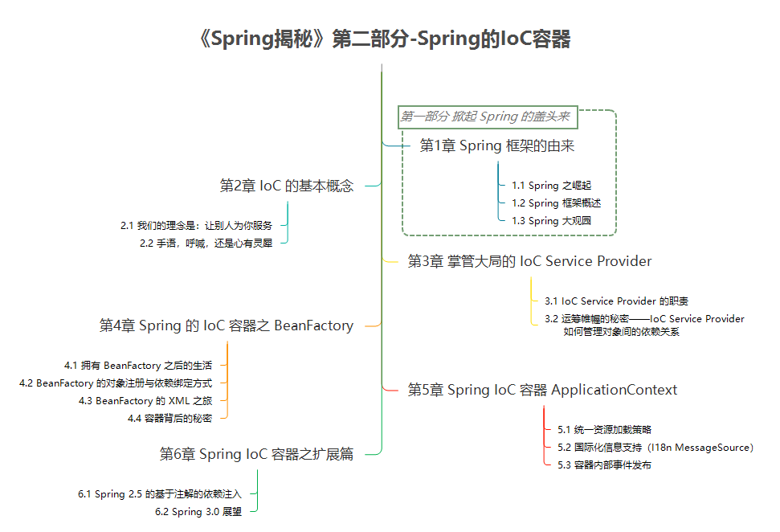

# 目录



------

第一部分 掀起Spring的盖头来

# 第1章 Spring框架的由来

> 本章内容
>
> - Spring 之崛起
> - Spring 框架概述
> - Spring 大观园 

**1.1 Spring 之崛起**

重装骑兵缺点开始显露无遗：

- 重装骑兵代价高昂。 
- 兵种自身限制太多。 
- 发挥作用的场景有限。 

当新的战术和兵种能够更加高效地完成作战任务时，依然主打重装骑兵的军队能取得什么样的战果，轻骑兵的出现已经给了我们一个明确的答案。 

如果不分场景地滥用 EJB， J2EE 平台上的这支“重装骑兵”的局限性自然会暴露出来。 

- 使用 EJB，通常也就意味着需要引入拥有 EJB Container 的应用服务器（J2EE Application Server）的支持，比如 BEA 的`WebLogic`或者 IBM 的`WebSphere`。
- 说到重装骑兵列装和部署的复杂和迟缓，使用EJB开发的企业级应用也存在同样的问题。 
- 重装骑兵需要合适的战机才能发挥其最大作用， EJB 也是如此。只有在分布式的场景中， EJB 才会带给我们最大的益处。

Spring 倡导一切从实际出发，以实用的态度来选择适合当前开发场景的解决方案。 

**1.2 Spring 框架概述**

Spring 框架所倡导的基于 POJO（Plain Old Java Object，简单 Java 对象）的轻量级开发理念，就是从实际出发，立足于最基础的 POJO（就好像我们的地球）。 

Spring 框架 POJO 提供的各种服务共同组成了 Spring 的生命之树，如图 1-1 所示。 


**1.3 Spring 大观园**

Spring 大观园中有一棵参天大树，它得以茁壮成长，主要因为它有一个好的根基，那就是 Spring 框架。在 Spring 框架的基础上， Spring 家族人丁开始兴旺，不断涌现出一个又一个引人注目的家族成员，包括：  

- Spring Web Flow（SWF）。Spring Web Flow 构建于 Spring Web MVC 框架之上，旨在简化拥有复杂用户交互逻辑的 Web 应用程序的开发。 
- Spring Web Services。Spring Web Services 是一套采用契约优先（Contract-First）开发模式，创建文档驱动（Document-driven） Web 服务的 Web 服务开发框架。 
- Spring Security（原来的Acegi Security）。Spring Security 由原来的Acegi Security 发展而来，主要为基于 Spring 框架的企业级应用程序提供安全解决方案。  
- Spring Dynamic Modules for OSGi Service Platforms。Spring-DM 是融合了 Spring 框架以及 OSGi 两家优良基因后的产物，它集 Spring 框架各种服务和 OSGi 的动态性、模块化等特性于一身，可以帮助我们以一种全新的方式来打造新一代的企业级应用程序。 
- Spring Batch。当意识到企业应用中批处理业务所占的市场份额不容小觑之后， Spring Batch 开始浮出水面，它是构建在 Spring 框架之上的一套轻量级批处理开发框架，由 SpringSource 和埃森哲（Accenture）合力打造。 
- Spring Integration。Spring Integration 面向创建基于 Spring 开发框架的企业集成（Enterprise 12 Integration）解决方案，对 Enterprise Integration Patterns 一书中的企业集成模式提供支持。 
- Spring LDAP。Spring LDAP 传承了 Spring 框架中应用模板方法模式（Template Method Pattern) 的优良传统，由最初的 LdapTemplate 发展演化而来，旨在简化 LDAP 相关操作。 
- Spring IDE。Spring IDE 以 Eclipse 开发平台为中心，想开发人员之所想，包含了各种实用的特性，为使用 Eclipse 创建基于Spring的应用程序，提供了灵活而强大的开发环境。 
- Spring Modules。为了避免 Spring 框架对各种其他项目的集成和支持造成 Spring 框架本身的臃肿等一系列问题， Spring Modules 将那些可选的工具和附加类库剥离出 Spring 核心框架，纳入自身进行统一管理。
- Spring JavaConfig。Spring 框架提供的依赖注入支持，最初是使用 XML 表述依赖注入关系的。在 Spring 2.5 正式提供了基于注解的依赖注入方式之前， Spring JavaConfig 就为 Spring 框架提出了一套基于注解的依赖注入解决方案，它可以看作是 Spring 2.5 中基于注解的依赖注入正式方案之外的另一种选择。 
- Spring Rich Client。与 Eclipse RCP 为基于 SWT/JFace 的 GUI 应用提供了一套完备的开发框架类似， Spring 也为使用 Swing 进行 GUI 开发的应用提供了一套开发框架，这就是 Spring Rich Client。如果你想在开发 Swing 应用的过程中同时获得 Spring 框架的各项支持的话，那Spring Rich Client 正是为你而生的。
- Spring .NET。 Spring 框架在 Java 平台上的成功是有目共睹的，这种成功同样渗透到了 .NET 平台， Spring .NET 就是 SpringSource 为 .NET 企业开发平台量身打造的开源应用开发框架。 
- Spring BeanDoc。Spring BeanDoc 可以根据 Spring 应用程序使用的配置文件中的相应信息，创建对应的文档和图表，帮助我们以更加直观的方式来了解 Spring 应用程序的整体结构。 

------

第二部分 Spring 的 IoC 容器

# 第2章 如何实现简单的 IoC 容器

**2.1 需要什么东西就让别人送过来**

为了更好地阐述 IoC 模式的概念，我们引入以下简单场景。

在我经历的 FX (Foreign Exchange 即外汇交易) 项目中，经常需要近乎实时地为客户提供外汇新闻。通常情况下，都是先从不同的新闻社订阅新闻来源，然后通过批处理程序定时地到指定的新闻服务器抓取最新的外汇新闻，接着将这些新闻存入本地数据库，最后在 FX 系统的前台界面显示。 

```java
public class FXNewsProvider {
    private IFXNewsListener newsListener;
    private IFXNewsPersister newPersistener;
    public void getAndPersistNews() {
		String[] newsIds = newsListener.getAvailableNewsIds();
		if(ArrayUtils.isEmpty(newsIds)) {
			return;
        }
        for(String newsId : newsIds) {
            FXNewsBean newsBean = newsListener.getNewsByPK(newsId);
            newPersistener.persistNews(newsBean);
            newsListener.postProcessIfNecessary(newsId);
        }
    }
}

```

其中， FXNewsProvider 需要依赖 IFXNewsListener 来帮助抓取新闻内容，并依赖 IFXNewsPersister 存储抓取的新闻。 

假设默认使用道琼斯（Dow Jones）新闻社的新闻，那么我们相应地提供了 DowJonesNewsListener 和 DowJonesNewsPersister 两个实现。

```java
public FXNewsProvider() {
    newsListener = new DowJonesNewsListener();
    newPersistener = new DowJonesNewsPersister();
}
```

回头想想，我们自己每次用到什么依赖对象都要主动地去获取，这是否真的必要？ 

对于 FXNewsProvider 来说，那就是在 getAndPersistNews() 方法调用 newsListener 的相应方法时，newsListener 能够准备就绪就可以了。如果有人能够在我们需要时将某个依赖对象送过来，为什么还要大费周折地自己去折腾？ 

其实 IoC 就这么简单！原来是需要什么东西自己去拿，现在是需要什么东西就让别人送过来。 


**2.2 别人怎么送过来？**

在 IoC 模式中，被注入对象又是通过哪些方式来通知 IoC Service Provider 为其提供适当服务的呢？ 

IoC 模式最权威的总结和解释，应该是 Martin Fowler 的那篇文章 “Inversion of Control Containers and the Dependency Injection pattern”，其中提到了三种依赖注入的方式，即构造方法注入（constructor injection）、setter 方法注入（setter injection）以及接口注入（interface injection）。下面让我们详细看一下这三种方式的特点及其相互之间的差别。

- 2.2.1 构造方法注入

```java
public FXNewsProvider(IFXNewsListener newsListner,IFXNewsPersister newsPersister) {
    this.newsListener = newsListner;
    this.newPersistener = newsPersister;
}
```

IoC Service Provider 会检查被注入对象的构造方法，取得它所需要的依赖对象列表，进而为其注入相应的对象。同一个对象是不可能被构造两次的，因此，被注入对象的构造乃至其整个生命周期，应该是由 IoC Service Provider 来管理的。

构造方法注入方式比较直观，对象被构造完成后，即进入就绪状态，可以马上使用。这就好比你刚进酒吧的门，服务生已经将你喜欢的啤酒摆上了桌面一样。坐下就可马上享受一份清凉与惬意。 

- 2.2.2 setter 方法注入

```java
public class FXNewsProvider {
    private IFXNewsListener newsListener;
    private IFXNewsPersister newPersistener;

    public IFXNewsListener getNewsListener() {
        return newsListener;
    }

    public void setNewsListener(IFXNewsListener newsListener) {
        this.newsListener = newsListener;
    }

    public IFXNewsPersister getNewPersistener() {
        return newPersistener;
    }

    public void setNewPersistener(IFXNewsPersister newPersistener) {
        this.newPersistener = newPersistener;
    }
}
```

这样，外界就可以通过调用 setNewsListener 和 setNewPersistener 方法为 FXNewsProvider 对象注入所依赖的对象了。 

setter 方法注入虽不像构造方法注入那样，让对象构造完成后即可使用，但相对来说更宽松一些，可以在对象构造完成后再注入。这就好比你可以到酒吧坐下后再决定要点什么啤酒，可以要百威，也可以要大雪，随意性比较强。如果你不急着喝，这种方式当然是最适合你的。

- 2.2.3 接口注入

被注入对象如果想要 IoC Service Provider 为其注入依赖对象，就必须实现某个接口。这个接口提供一个方法，用来为其注入依赖对象。IoC Service Provider 最终通过这些接口来了解应该为被注入对象注入什么依赖对象。 

FXNewsProvider 为了让 IoC Service Provider 为其注入所依赖的IFXNewsListener，首先需要实现 FXNewsListenerCallable 接口，这个接口会声明一个 injectNewsListener 方法（方法名随意），该方法的参数，就是所依赖对象的类型。这样，InjectionServiceContainer 对象，即对应的 IoC Service Provider 就可以通过这个接口方法将依赖对象注入到被注入对象 FXNewsProvider 当中。 


接口注入方式最早并且使用最多的是在一个叫做 Avalon 的项目中，相对于前两种依赖注入方式，接口注入比较死板和烦琐。如果需要注入依赖对象，被注入对象就必须声明和实现另外的接口。这就好像你同样在酒吧点啤酒，为了让服务生理解你的意思，你就必须戴上一顶啤酒杯式的帽子，看起来有点多此一举。

# 第3章 IoC 可以用来做什么？

虽然业务对象可以通过 IoC 方式声明相应的依赖，但是最终仍然需要通过某种角色或者服务将这些相互依赖的对象绑定到一起，而 IoC Service Provider 就对应 IoC 场景中的这一角色。IoC Service Provider 在这里是一个抽象出来的概念，它可以指代任何将 IoC 场景中的业务对象绑定到一起的实现方式。

**3.1 IoC Service Provider 的职责**

IoC Service Provider 的职责相对来说比较简单，主要有两个：业务对象的构建管理和业务对象间的依赖绑定。

- 业务对象的构建管理。IoC Service Provider 需要将对象的构建逻辑从客户端对象那里剥离出来，以免这部分逻辑污染业务对象的实现。
- 业务对象间的依赖绑定。IoC Service Provider 通过结合之前构建和管理的所有业务对象，以及各个业务对象间可以识别的依赖关系，将这些对象所依赖的对象注入绑定，从而保证每个业务对象在使用的时候，可以处于就绪状态。

**3.2 IoC Service Provider 如何管理对象间的依赖关系**

- 3.2.1 直接编码方式

  当前大部分的IoC容器都应该支持直接编码方式，比如PicoContainer 、 Spring、 Avalon等。在容器启动之前，我们就可以通过程序编码的方式将被注入对象和依赖对象注册到容器中，并明确它们相互之间的依赖注入关系。 

  ```java
  IoContainer container = ...;
  container.register(FXNewsProvider.class, new FXNewsProvider());
  container.register(IFXNewsListener.class, new DowJonesNewsListener());
  ...
  FXNewsProvider newsProvider = (FXNewsProvider)container.get(FXNewsProvider.class);
  newProvider.getAndPersistNews();
  ```

- 3.2.2 配置文件方式

  ```xml
  <bean id="newsProvider" class="..FXNewsProvider">
      <property name="newsListener">
          <ref bean="djNewsListener"/>
      </property>
      <property name="newPersistener">
          <ref bean="djNewsPersister"/>
      </property>
  </bean>
  <bean id="djNewsListener" class="..impl.DowJonesNewsListener"></bean>
  <bean id="djNewsPersister" class="..impl.DowJonesNewsPersister"></bean>
  ```

  最后，我们就可以通过 “newsProvider” 这个名字，从容器中取得已经组装好的 FXNewsProvider 并直接使用。

  ```java
  container.readConfigurationFiles(...);
  FXNewsProvider newsProvider = (FXNewsProvider) container.getBean("newsProvider");
  newsProvider.getAndPersistNews();
  ```

- 3.2.3 元数据方式

  ```java
  public class FXNewsProvider {
      private IFXNewsListener newsListener;
      private IFXNewsPersister newPersistener;
      @Inject
      public FXNewsProvider(IFXNewsListener listener,IFXNewsPersister persister) {
          this.newsListener = listener;
          this.newPersistener = persister;
      }
      ...
  }
  ```

  通过 @Inject，我们指明需要 IoC Service Provider 通过构造方法注入方式，为 FXNewsProvider 注入其所依赖的对象。至于余下的依赖相关信息，在Guice 中是由相应的 Module 来提供的。

  ```java
  public class NewsBindingModule extends AbstractModule {
      @Override
      protected void configure() {
      	bind(IFXNewsListener.class).to(DowJonesNewsListener.class).in(Scopes.SINGLETON);
      	bind(IFXNewsPersister.class).to(DowJonesNewsPersister.class).in(Scopes.SINGLETON);
      }
  }
  ```

  通过 Module 指定进一步的依赖注入相关信息之后，我们就可以直接从 Guice 那里取得最终已经注入完毕，并直接可用的对象了。

  ```java
  Injector injector = Guice.createInjector(new NewsBindingModule());
  FXNewsProvider newsProvider = injector.getInstance(FXNewsProvider.class);
  newsProvider.getAndPersistNews();
  ```

  当然， 注解最终也要通过代码处理来确定最终的注入关系，从这点儿来说，注解方式可以算作编码方式的一种特殊情况。 

# 第4章 使用 BeanFactory 获取 IoC 里的 Bean

Spring 的 IoC 容器是一个提供 IoC 支持的轻量级容器，除了基本的 IoC 支持，它作为轻量级容器还提供了 IoC 之外的支持。


Spring 提供了两种容器类型：BeanFactory 和 ApplicationContext。

- BeanFactory。基础类型 IoC 容器，提供完整的 IoC 服务支持。如果没有特殊指定，默认采用延迟初始化策略（lazy-load）。
- ApplicationContext。ApplicationContext 在 BeanFactory 的基础上构建，是相对比较高级的容器实现，除了拥有 BeanFactory 的所有支持，ApplicationContext 还提供了其他高级特性，比如事件发布、国际化信息支持等。


**4.1 拥有 BeanFactory 之后的生活**

之前我们的系统业务对象需要自己去“拉”（Pull）所依赖的业务对象，有了 BeanFactory 之类的 IoC 容器之后，需要依赖什么让 BeanFactory 为我们推过来（Push）就行了。所以，简单点儿说，拥有 BeanFactory 之后，要使用 IoC 模式进行系统业务对象的开发。

在 BeanFactory 出现之前，我们通常会直接在应用程序的入口类的 main 方法中，自己实例化相应的对象并调用之，如以下代码所示：

```java
FXNewsProvider newsProvider = new FXNewsProvider();
newsProvider.getAndPersistNews();
```

不过，现在既然有了 BeanFactory，我们通常只需将“生产线图纸”交给 BeanFactory，让 BeanFactory 为我们生产一个 FXNewsProvider，如以下代码所示：

```java
BeanFactory container = new XmlBeanFactory(new ClassPathResource("配置文件路径"));
FXNewsProvider newsProvider = (FXNewsProvider) container.getBean("djNewsProvider");
newsProvider.getAndPersistNews();
```

或者如以下代码所示：

```java
ApplicationContext container = new ClassPathXmlApplicationContext("配置文件路径");
FXNewsProvider newsProvider = (FXNewsProvider) container.getBean("djNewsProvider");
newsProvider.getAndPersistNews();
```

亦或如以下代码所示：

```java
ApplicationContext container = new FileSystemXmlApplicationContext("配置文件路径");
FXNewsProvider newsProvider = (FXNewsProvider) container.getBean("djNewsProvider");
newsProvider.getAndPersistNews();
```

这就是拥有 BeanFactory 后的生活。当然，这只是使用 BeanFactory 后开发流程的一个概览而已，具体细节请容我慢慢道来。

**4.2 BeanFactory 的对象注册与依赖绑定方式**

- 4.2.1 直接编码方式

  > 其实，把编码方式单独提出来称作一种方式并不十分恰当。因为不管什么方式，最终都需要编码才能“落实”所有信息并付诸使用。不过，通过这些代码，起码可以让我们更加清楚 BeanFactory 在底层是如何运作的。  

  

  下面来看一下我们的FX新闻系统相关类是如何注册并绑定的。

  ```java
  public static void main(String[] args) {
      DefaultListableBeanFactory beanRegistry = new DefaultListableBeanFactory();
      BeanFactory container = (BeanFactory) bindViaCode(beanRegistry);
      FXNewsProvider newsProvider = (FXNewsProvider)container.getBean("djNewsProvider");
      newsProvider.getAndPersistNews();
  }
  
  public static BeanFactory bindViaCode(BeanDefinitionRegistry registry) {
      AbstractBeanDefinition newsProvider = new RootBeanDefinition(FXNewsProvider.class,true);
      AbstractBeanDefinition newsListener = new RootBeanDefinition(DowJonesNewsListener.class,true);
      AbstractBeanDefinition newsPersister = new RootBeanDefinition(DowJonesNewsPersister.class,true);
      // 将bean定义注册到容器中
      registry.registerBeanDefinition("djNewsProvider", newsProvider);
      registry.registerBeanDefinition("djListener", newsListener);
      registry.registerBeanDefinition("djPersister", newsPersister);
      // 指定依赖关系
      // 1. 可以通过构造方法注入方式
      ConstructorArgumentValues argValues = new ConstructorArgumentValues();
      argValues.addIndexedArgumentValue(0, newsListener);
      argValues.addIndexedArgumentValue(1, newsPersister);
      newsProvider.setConstructorArgumentValues(argValues);
      // 2. 或者通过setter方法注入方式
      MutablePropertyValues propertyValues = new MutablePropertyValues();
      propertyValues.addPropertyValue(new ropertyValue("newsListener",newsListener));
      propertyValues.addPropertyValue(new PropertyValue("newPersistener",newsPersister));
      newsProvider.setPropertyValues(propertyValues);
      // 绑定完成
      return (BeanFactory)registry;
  }
  ```

- 4.2.2 外部配置文件方式

  Properties 配置格式的加载；XML 配置格式的加载。

- 4.2.3 注解方式

  在 Spring 2.5 发布之前，Spring 框架并没有正式支持基于注解方式的依赖注入；Spring 2.5 发布了基于注解的依赖注入方式。

  ```java
  @Component
  public class FXNewsProvider {
      @Autowired
      private IFXNewsListener newsListener;
      @Autowired
      private IFXNewsPersister newPersistener;
      public FXNewsProvider(IFXNewsListener newsListner, IFXNewsPersister newsPersister) {
          this.newsListener = newsListner;
          this.newPersistener = newsPersister;
      }
      ...
  }
  @Component
  public class DowJonesNewsListener implements IFXNewsListener {
      ...
  }
  @Component
  public class DowJonesNewsPersister implements IFXNewsPersister {
      ...
  }
  ```

**4.3 BeanFactory 的 XML 之旅**

> XML 的方式现在很少用了。

- 4.3.1 \<beans\>和\<bean\>
- 4.3.2 孤孤单单一个Bean
- 4.3.3 Help Me, Help You
- 4.3.4 继承？我也会！
- 4.3.5 bean 的 scope
- 4.3.6 工厂方法与 FactoryBean
- 4.3.7 偷梁换柱之术

**4.4 容器启动的秘密**

- 4.4.1 容器的初始化概览

  Spring 的 IoC 容器实现以上功能的过程，基本上可以按照类似的流程划分为两个阶段，即容器启动阶段和 Bean 实例化阶段。

  

  容器启动伊始，容器需要依赖某些工具类 BeanDefinitionReader 对加载的 Configuration MetaData 进行解析和分析，并将分析后的信息编组为相应的 BeanDefinition，最后注册到相应的 BeanDefinitionRegistry，这样容器启动工作就完成了。

  Bean 实例化阶段，容器会首先检查所请求的对象之前是否已经初始化。如果没有，则会根据注册的 BeanDefinition 所提供的信息实例化被请求对象，并为其注入依赖。当该对象装配完毕之后，容器会立即将其返回请求方使用。

- 4.4.2 插手“容器的启动”

  PropertyPlaceholderConfigurer：可以在 XML 配置文件中使用占位符；

  PropertyOverrideConfigurer：可以对容器中配置的 property 信息进行覆盖替换；

  CustomEditorConfigurer：帮助我们传达类似由字符串到具体对象的转换的信息；

- 4.4.3 了解 bean 的一生

  类 org.springframework.context.support.AbstractApplicationContext 的 refresh() 方法里描述了 bean 的一生。

  

  a. Bean 的实例化与 BeanWrapper。采用策略模式来决定采用何种方式初始化 bean 实例；

  b. 各色的 Aware 接口。将这些 Aware 接口定义中规定的依赖注入给当前对象实例。这些 Aware 有：BeanNameAware, BeanClassLoaderAware, BeanFactoryAware...；

  c. BeanPostProcessor。postProcessBeforeInitialization, postProcessAfterInitialization；

  d. 自定义 BeanPostProcessor。比如用于解密的 PasswordDecodePostProcessor；

  e. InitializingBean 和 init-method。如果某个业务对象实例化完成后，还不能处于可以使用状态，可在 afterPropertiesSet 完成；

  f. DisposableBean 与 destroy-method。销毁对象，比如关闭连接池。

# 第5章 Spring IoC 容器 ApplicationContext

> 本章内容
>
> - 统一资源加载策略
> - 国际化信息支持
> - 容器内部事件发布
> - 多配置模块加载的简化

ApplicationContext 除了拥有 BeanFactory 支持的所有功能之外，还进一步扩展了基本容器的功能，包括 BeanFactoryPostProcessor、BeanPostProcessor 以及其他特殊类型 bean 的自动识别、容器启动后 bean 实例的自动初始化、国际化的信息支持、容器内事件发布等。

**5.1 统一资源加载策略**

为什么 Spring 要统一资源加载策略？Java SE 提供的标准类 java.net.URL 功能职责划分不清，资源的查找和资源的表示没有一个清晰的界限。所以，Spring 提出了一套基于 org.springframework.core.io.Resource 和 org.springframework.core.io.ResourceLoader 接口的资源抽象和加载策略。

- 5.1.1 Spring 中的 Resource

  是所有资源的抽象和访问接口。

- 5.1.2 ResourceLoader，“更广义的 URL”

  

  可用的 ResourceLoader 有 DefaultResourceLoader, FileSystemResourceLoader；

  ResourcePatternResolver：批量查找的 ResourceLoader；

- 5.1.3 ApplicationContext 与 ResourceLoader

  
  
  扮演 ResourceLoader 的角色：可以来加载 Resource；
  
  ResourceLoader 类型的注入：通过 ResourceLoaderAware 注入；
  
  Resource 类型的注入：注册 PropertyEditor 实现到容器中；

**5.2 国际化信息支持（I18n MessageSource）**

要向全世界推广，应用程序的国际化信息支持自然是势在必行。

- 5.2.1 Java SE 提供的国际化支持

  对于 Java 中的国际化信息处理，主要涉及两个类， 即 java.util.Locale 和 java.util.ResourceBundle。

- 5.2.2 MessageSource 与 ApplicationContext

  Spring 在 Java SE 的国际化支持的基础上，进一步抽象了国际化信息的访问接口，也就是
  org.springframework.context.MessageSource。

**5.3 容器内部事件发布**

- 5.3.1 自定义事件发布

  Java SE 提供了 java.util.EventObject 类和 java.util.EventListener 接口实现自定义事件发布。

- 5.3.2 Spring 的容器内事件发布类结构分析

  

# 第6章 Spring IoC 容器之扩展篇

> 本章内容
>
> - Spring 2.5 的基于注解的依赖注入
> - Spring 3.0 展望

**6.1 Spring 2.5 的基于注解的依赖注入**

- 6.1.1 注解版的自动绑定（@Autowired）

  @Autowired 是按照类型进行匹配，如果有两个或者多个同一类型的对象实例，可以使用 @Qualifier 对依赖注入的条件做进一步限定。

- 6.1.2 @Autowired之外的选择--使用 JSR250 标注依赖注入关系

  可以使用 JSR250 的 @Resource 和 @PostConstruct 以及 @PreDestroy。

- 6.1.3 将革命进行得更彻底一些（classpath-scanning 功能介绍）

  \<context:component-scan\> 默认扫描的注解类型是 @Component。不过，在 @Component 语义基础上细化后的 @Repository、@Service 和 @Controller 也同样可以获得\<context:component-scan\> 的青睐。   

**6.2 Spring 3.0 展望**

Spring 3.0 将顺应 Java 5 带来的泛型、注解等新特性；

基于注解的工厂方法（Annotation-based Factory method）；